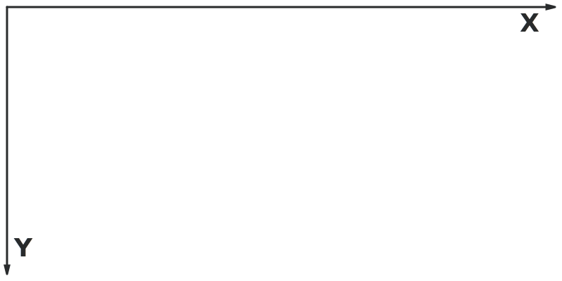

If you're new to freesewing (or SVG) we need to cover some fundamental concepts.

## The coordinate system

Coordinates are like text in a book. 
You start at the top on the left side, and going to the right and downwards means going ahead.

## Units

Internally, freesewing uses millimeter. 
When you see 1, that's one mm. When we say 7.8, that's 7.8mm.

While we support both metric and imperial output, all input should be in mm.

## SVG

Patterns are rendered as SVG — short for [Scalable Vector 
Graphics](https://en.wikipedia.org/wiki/Scalable_Vector_Graphics) —, 
an XML-based vector image format and an open standard.

While you don't need to be an SVG expert, a basic understanding of 
the format will greatly help you to understand freesewing.

## Bezier curves

While lines on computers are easy to store with a start and end point, curves require more information.

In freesewing, as in SVG and countless of other applications, curves are stored as Bezier curves.
They have:

 - A start point
 - A first control point that's linked to the start piont
 - A second control point that's linked to the end point
 - An end point

Bezier curves are more intuitive as you might think. I find this illustration rather helpful:

## config vs settings

When we say **config**, we mean the configuration of the pattern as created by the 
pattern designer/developer.

For example, whether or not there is an option to change the collar style is a config matter.

When we say **settings** we mean the settings the user specifies to create their draft.

Whether to include seam allowance or not is a settings matter.

## draft vs render

Generating a pattern is a two-step process. First, the pattern is **drafted**. 
It will calculate the coordinates for all the points, and do everything needed
to bring your pattern object to a state where it has all the information required to 
**render** it. Rendering then turns your pattern into SVG output.

> ###### Don't want SVG? No problem
>
> The reason these two are seperated is to be able to support different output formats.
> 
> If you wanted to render to PostScript, or HTML Canvas, you could write a plugin that
> provides a custom render method.

